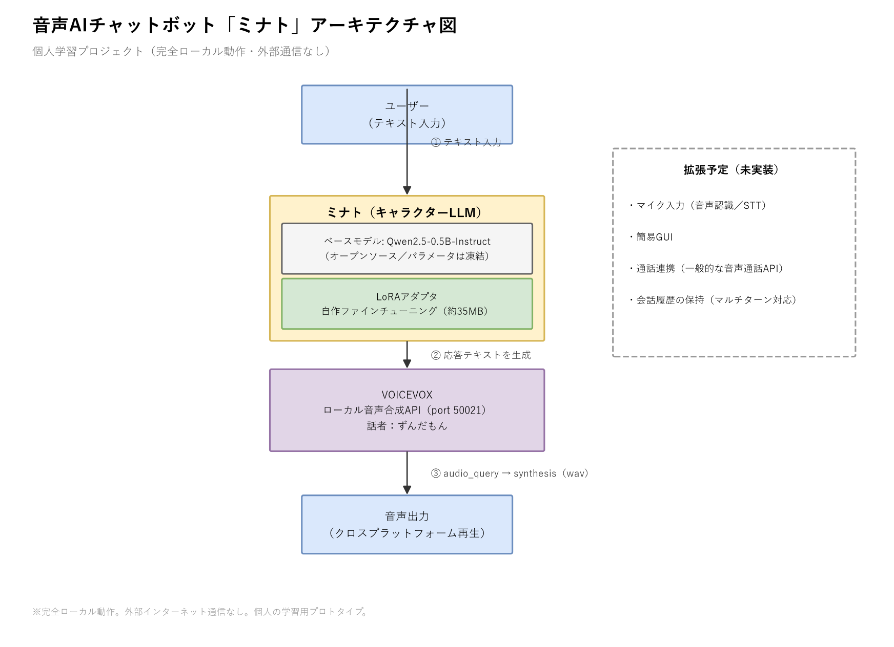

# ミナト (Minato) — a tiny voice AI chatbot


A personal learning project: a small, fully local voice-chatbot persona built by
LoRA-fine-tuning an open-source 0.5B-parameter LLM and giving it a voice with
[VOICEVOX](https://voicevox.hiroshiba.jp/). No cloud APIs, no external calls at
inference time.

This repo intentionally contains **no company names or personal names** — it's
published as a standalone individual project.

## Architecture



The diagram source (`architecture/minato_architecture.drawio`) can be opened and
edited in [draw.io](https://app.diagrams.net) or the VS Code
[Draw.io Integration](https://marketplace.visualstudio.com/items?itemName=hediet.vscode-drawio)
extension. Regenerate the PNG anytime with:

```bash
python architecture/generate_architecture_diagram.py architecture/minato_architecture.png
```

| Component | Technology |
|---|---|
| Base LLM | [Qwen2.5-0.5B-Instruct](https://huggingface.co/Qwen/Qwen2.5-0.5B-Instruct) (frozen) |
| Persona | LoRA adapter, self-trained (`out/lora/`, ~35MB) |
| Text-to-speech | [VOICEVOX Engine](https://github.com/VOICEVOX/voicevox_engine) (local HTTP API) |
| Playback (desktop mode) | `sounddevice` + `soundfile` (cross-platform: Windows/macOS/Linux) |

## Two ways to run it

### 1. Desktop mode (talks out loud through your speakers)

```bash
python -m venv .venv
source .venv/bin/activate   # Windows: .venv\Scripts\activate
pip install -r requirements.txt

# Start a VOICEVOX engine (either works):
#   a) the desktop app, or
#   b) docker compose up voicevox

python src/minato_talk.py
```

```
python src/minato_talk.py --list-speakers   # see all available voices
python src/minato_talk.py --speaker 3       # pick a different voice
```

### 2. Headless API mode (containerized, no speakers needed)

```bash
docker compose up --build
```

```bash
curl -X POST http://localhost:8080/chat \
  -H "Content-Type: application/json" \
  -d '{"text": "こんにちは"}' \
  -o reply.wav
```

Returns raw WAV bytes; the generated reply text is in the
`X-Minato-Reply-Text` response header (URL-encoded).

The `app` image is CPU-only by design, so `docker compose up` works identically
on any machine — no NVIDIA driver / CUDA toolkit required. If you have an NVIDIA
GPU and run the desktop mode natively, install the CUDA build of torch instead
for faster generation:

```bash
pip install torch --index-url https://download.pytorch.org/whl/cu124
```

## Re-training the persona

The LoRA adapter in `out/lora/` was trained on `data/train.jsonl`
(19 examples, ~1 minute on a single consumer GPU). To reproduce or modify it:

```bash
python data/make_data.py       # regenerate data/train.jsonl
python finetune_lora.py        # trains out/lora/ from data/train.jsonl
```

## CI/CD

- **CI** (`.github/workflows/ci.yml`): on every push/PR, lints the code and runs
  a real end-to-end smoke test — spins up the VOICEVOX engine as a service
  container, starts the API, sends a chat request, and asserts a valid WAV comes
  back. Free (GitHub Actions, public repo).
- **CD** (`.github/workflows/cd.yml`): on pushing a version tag (`v*.*.*`),
  builds the headless API image and publishes it to GitHub Container Registry
  (`ghcr.io`) — free for public repos, no external registry account needed.

## Known limitations

- No microphone input yet (text in, voice out only).
- No conversation memory (single-turn only).
- Trained on only 19 examples — outside that narrow scope it can produce
  plausible-sounding but incorrect answers (small-model hallucination), not
  general intelligence.

## License

MIT — see [LICENSE](LICENSE).
